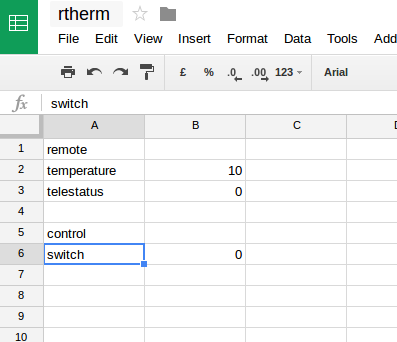

# remote_therm

Remote switch to our home thermostat

* honeywell chronotherm IV modulation
* particle photon
* some small stuff
 * 2 1.5V AA batteries
 * xx Ohm resistor
 * transistor P2N2222A
 * some wire

particle create webhook switch.json